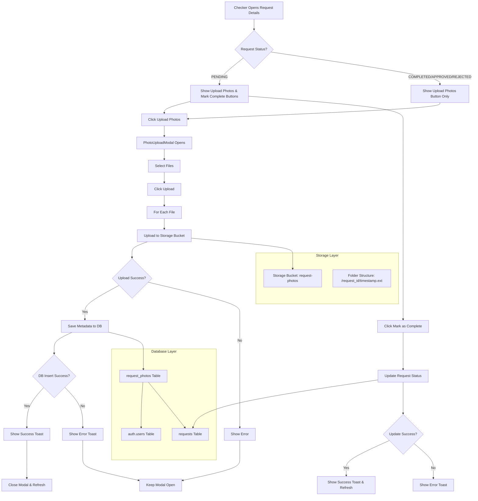
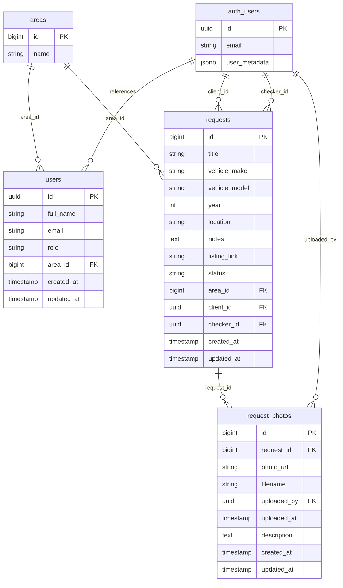

# Supabase Setup for Photo Upload Feature

## Architecture Overview



## Required Database Tables

### 1. Create `request_photos` Table

Run this SQL in your Supabase SQL Editor:

```sql
-- Create request_photos table
CREATE TABLE request_photos (
  id BIGSERIAL PRIMARY KEY,
  request_id BIGINT NOT NULL,
  photo_url TEXT NOT NULL,
  filename TEXT NOT NULL,
  uploaded_by UUID REFERENCES auth.users(id),
  uploaded_at TIMESTAMP WITH TIME ZONE DEFAULT NOW(),
  description TEXT,
  created_at TIMESTAMP WITH TIME ZONE DEFAULT NOW(),
  updated_at TIMESTAMP WITH TIME ZONE DEFAULT NOW()
);

-- Add foreign key constraint to requests table
ALTER TABLE request_photos
ADD CONSTRAINT fk_request_photos_request_id
FOREIGN KEY (request_id) REFERENCES requests(id) ON DELETE CASCADE;

-- Create indexes for better performance
CREATE INDEX idx_request_photos_request_id ON request_photos(request_id);
CREATE INDEX idx_request_photos_uploaded_by ON request_photos(uploaded_by);

-- Enable Row Level Security (RLS)
ALTER TABLE request_photos ENABLE ROW LEVEL SECURITY;

-- Create RLS policies
-- Allow users to see photos for requests they are involved in
CREATE POLICY "Users can view photos for their requests" ON request_photos
  FOR SELECT
  USING (
    EXISTS (
      SELECT 1 FROM requests
      WHERE requests.id = request_photos.request_id
      AND (requests.client_id = auth.uid() OR requests.checker_id = auth.uid())
    )
  );

-- Allow checkers to upload photos for their assigned requests
CREATE POLICY "Checkers can upload photos for their requests" ON request_photos
  FOR INSERT
  WITH CHECK (
    EXISTS (
      SELECT 1 FROM requests
      WHERE requests.id = request_photos.request_id
      AND requests.checker_id = auth.uid()
    )
  );

-- Allow photo uploaders to update their own photos
CREATE POLICY "Users can update their own photos" ON request_photos
  FOR UPDATE
  USING (uploaded_by = auth.uid());

-- Allow photo uploaders to delete their own photos
CREATE POLICY "Users can delete their own photos" ON request_photos
  FOR DELETE
  USING (uploaded_by = auth.uid());
```

## 2. Create Storage Bucket

In your Supabase Dashboard:

1. Go to **Storage** section
2. Create a new bucket called `request-photos`
3. Make it **Public** (for easier access to photos)
4. Set up the following bucket policies:

### Storage Policies

```sql
-- Allow authenticated users to upload photos
CREATE POLICY "Allow authenticated uploads" ON storage.objects
  FOR INSERT
  WITH CHECK (
    bucket_id = 'request-photos'
    AND auth.role() = 'authenticated'
  );

-- Allow users to view photos for requests they're involved in
CREATE POLICY "Allow viewing request photos" ON storage.objects
  FOR SELECT
  USING (
    bucket_id = 'request-photos'
    AND auth.role() = 'authenticated'
  );

-- Allow users to update/delete their own uploaded photos
CREATE POLICY "Allow users to manage their photos" ON storage.objects
  FOR UPDATE
  USING (
    bucket_id = 'request-photos'
    AND auth.uid()::text = (storage.foldername(name))[1]
  );

CREATE POLICY "Allow users to delete their photos" ON storage.objects
  FOR DELETE
  USING (
    bucket_id = 'request-photos'
    AND auth.uid()::text = (storage.foldername(name))[1]
  );
```

## 3. Update Existing Tables (if needed)

Make sure your `requests` table has the proper structure:

```sql
-- Verify requests table structure
SELECT column_name, data_type, is_nullable
FROM information_schema.columns
WHERE table_name = 'requests';

-- If needed, add missing columns:
ALTER TABLE requests ADD COLUMN IF NOT EXISTS checker_id UUID REFERENCES auth.users(id);
ALTER TABLE requests ADD COLUMN IF NOT EXISTS client_id UUID REFERENCES auth.users(id);

-- Update status column to include COMPLETED status (if using ENUM)
-- If your status column is using an ENUM, you might need to alter it:
-- ALTER TYPE request_status ADD VALUE IF NOT EXISTS 'COMPLETED';

-- Or if using TEXT/VARCHAR with constraints, update the constraint:
-- ALTER TABLE requests DROP CONSTRAINT IF EXISTS status_check;
-- ALTER TABLE requests ADD CONSTRAINT status_check
--   CHECK (status IN ('PENDING', 'APPROVED', 'REJECTED', 'COMPLETED'));
```

## 4. Optional: Create Helper Views

For easier querying, you can create views that include photo information:

```sql
-- Create view for requests with photo counts
CREATE OR REPLACE VIEW requests_with_photo_count AS
SELECT
  r.*,
  COALESCE(photo_counts.photo_count, 0) as photo_count
FROM requests r
LEFT JOIN (
  SELECT
    request_id,
    COUNT(*) as photo_count
  FROM request_photos
  GROUP BY request_id
) photo_counts ON r.id = photo_counts.request_id;

-- Create view for requests with photos
CREATE OR REPLACE VIEW requests_with_photos AS
SELECT
  r.*,
  COALESCE(
    json_agg(
      json_build_object(
        'id', rp.id,
        'photo_url', rp.photo_url,
        'filename', rp.filename,
        'uploaded_at', rp.uploaded_at,
        'description', rp.description
      )
    ) FILTER (WHERE rp.id IS NOT NULL),
    '[]'::json
  ) as photos
FROM requests r
LEFT JOIN request_photos rp ON r.id = rp.request_id
GROUP BY r.id;
```

## 5. Environment Variables

Make sure your `.env` file has:

```env
SUPABASE_URL=your_supabase_url
SUPABASE_ANON_KEY=your_supabase_anon_key
```

## 6. Test the Setup

You can test the upload functionality by:

1. Logging in as a checker
2. Opening a request details modal
3. Clicking "Upload Photos"
4. Selecting image files
5. Clicking upload

The photos should be stored in the `request-photos` bucket with the structure:

```
request-photos/
  ├── request_1/
  │   ├── 1640995200000.jpg
  │   └── 1640995300000.png
  └── request_2/
      └── 1640995400000.jpg
```

## Troubleshooting

If you get permission errors:

1. Check that RLS policies are set up correctly
2. Verify the user is authenticated
3. Ensure the user has the correct role (checker) for the request
4. Check that the storage bucket exists and is public
5. Verify the bucket policies allow the operation

## Security Notes

- Photos are organized by request ID in folders
- Only authenticated users can upload
- Only users involved in a request can view its photos
- Users can only delete their own uploaded photos
- All operations are logged with user ID and timestamp

## Database Relationships


