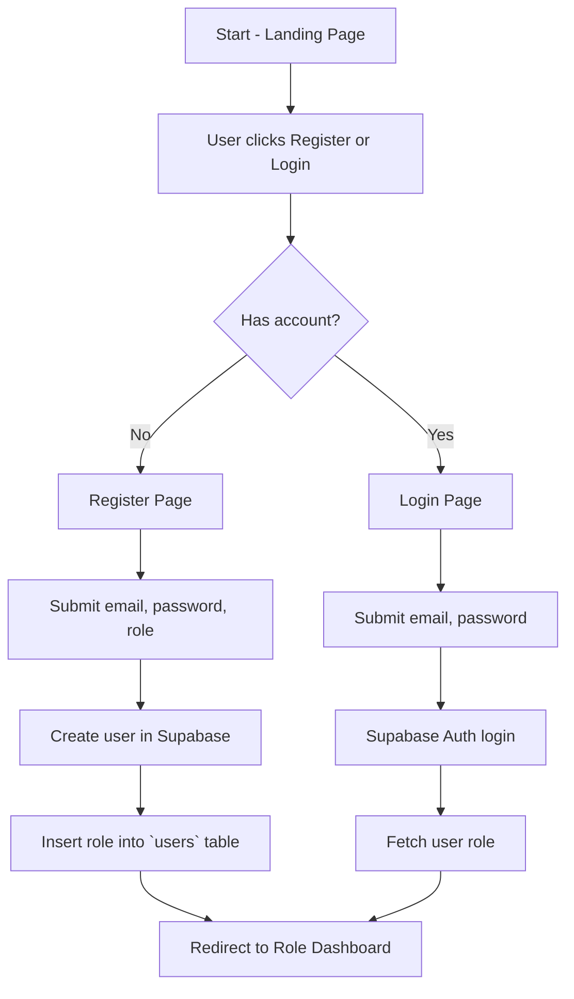

```mermaid
flowchart TD
  A[Start - Landing Page] --> B[User clicks Register or Login]
  B --> C{Has account?}
  C -- No --> D[Register Page]
  D --> E[Submit email, password, role]
  E --> F[Create user in Supabase]
  F --> G[Insert role into `users` table]
  G --> H[Redirect to Role Dashboard]

  C -- Yes --> I[Login Page]
  I --> J[Submit email, password]
  J --> K[Supabase Auth login]
  K --> L[Fetch user role]
  L --> H
```
